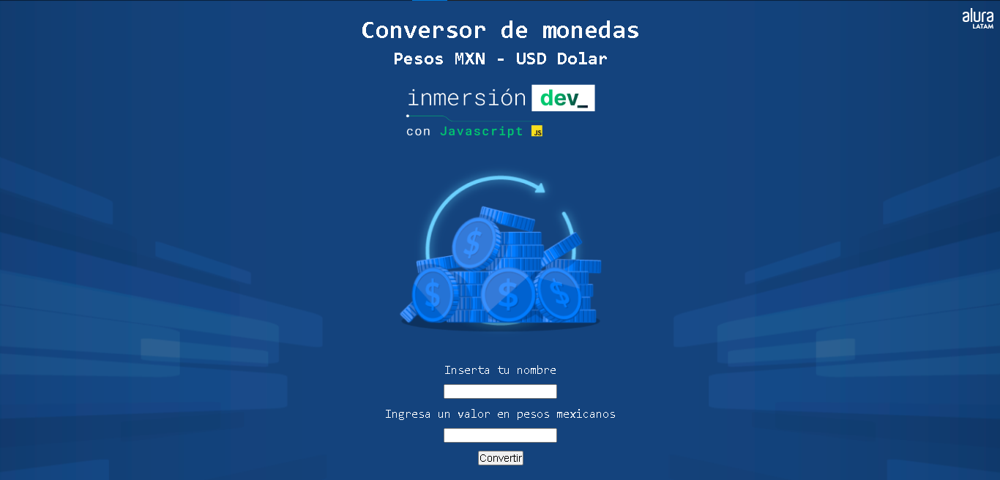

# ConversorMoneda

Aplicacion de un conversor para el tipo de cambio de pesos mexicanos a dolares

<h3><a href="https://github.com/Yoel-Gasca/ConversorMoneda">Repocitorio: Clase 1 - Elaboracion de un conversor de moneda</a></h3>

