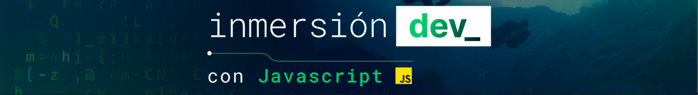

# InmersionDev_
En este repocitorio se almacenara el contenido de las clases con anotaciones y desarrollo de los desafios de la inmersión en Dev_ con JavaScript de Alura Latam.

| Contenidos                     | Proyectos          | Ver proyecto         |
| ------------------------------ | ------------------ | ----------------------------- | 
| CLASE 1 | Proyecto: Conversor de monedas | <a href="https://github.com/Yoel-Gasca/InmersionDev_/tree/main/CLASE-01-Conversor">Ir al proyecto</a> | 
CLASE 2 | Proyecto: El Mentalista | <a href="https://github.com/Yoel-Gasca/InmersionDev_/tree/main/CLASE-02-Mentalista">Ir al proyecto</a>| 
CLASE 3 y 4 | Proyecto: AluraFlix | <a href="https://github.com/Yoel-Gasca/InmersionDev_/tree/main/CLASE-03y04-AluraFlix">Ir al proyecto</a>|

